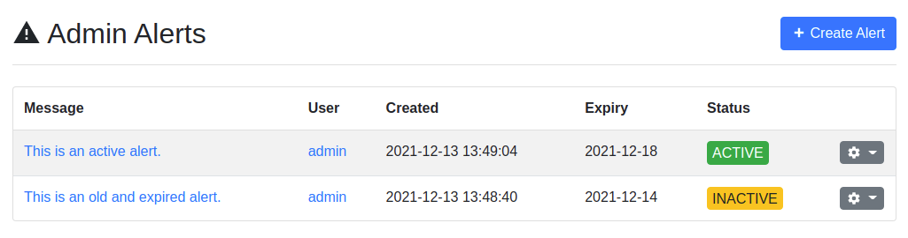
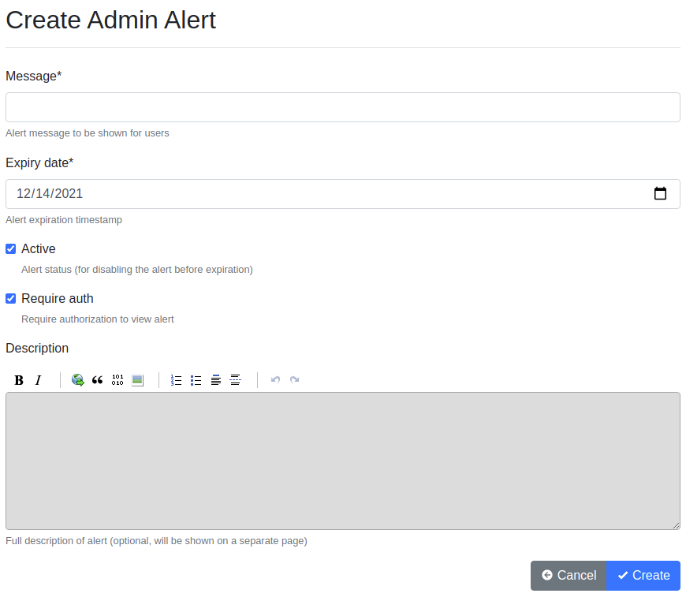
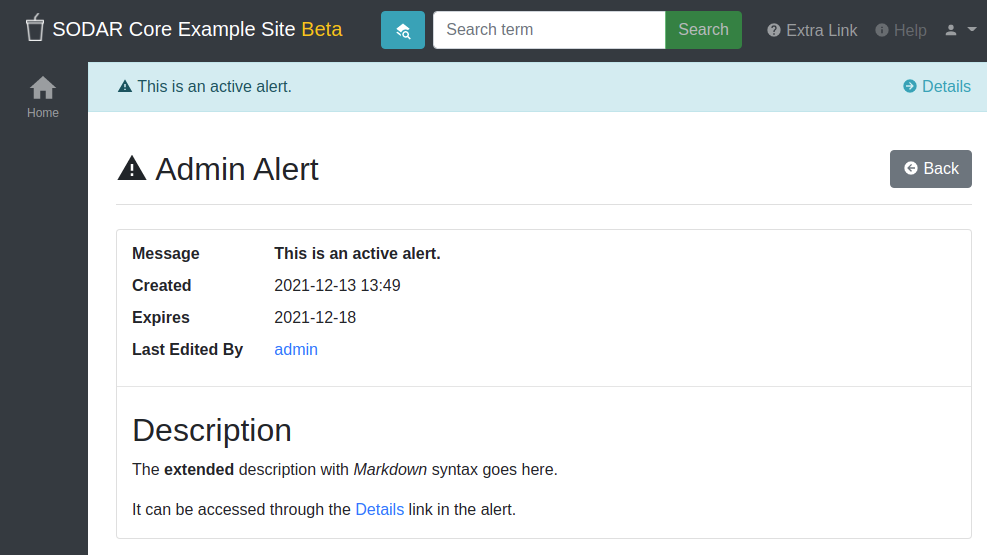

.. _app_adminalerts:

Adminalerts App
^^^^^^^^^^^^^^^

The ``adminalerts`` site app enables system administrators to display site-wide
messages to all users with an expiration date.

Basics
======

The app displays un-dismissable small alerts on the top of page content to all
users. They can be used to e.g. warn users of upcoming downtime or highlight
recently deployed changes.

Upon creation, an expiration date is set for each alert. Alerts can also be
freely enabled, disabled or deleted by superuser on the app UI. Additional
information regarding an alert can be provided with Markdown syntax and viewed
on a separate details page.

Installation
============

.. warning::

    To install this app you **must** have the ``django-sodar-core`` package
    installed and the ``projectroles`` app integrated into your Django site.
    See the :ref:`projectroles integration document <app_projectroles_integration>`
    for instructions.

Django Settings
---------------

The adminalerts app is available for your Django site after installing
``django-sodar-core``. Add the app into ``THIRD_PARTY_APPS`` as follows:

.. code-block:: python

    THIRD_PARTY_APPS = [
        # ...
        'adminalerts.apps.AdminalertsConfig',
    ]

Optional Settings
-----------------

To alter default adminalerts app settings, insert the following **optional**
variables with values of your choosing:

.. code-block:: python

    # Adminalerts app settings
    ADMINALERTS_PAGINATION = 15    # Number of alerts to be shown on one page (int)

URL Configuration
-----------------

In the Django URL configuration file, add the following line under
``urlpatterns`` to include adminalerts URLs in your site.

.. code-block:: python

    urlpatterns = [
        # ...
        url(r'^alerts/admin/', include('adminalerts.urls')),
    ]

Migrate Database and Register Plugin
------------------------------------

To migrate the Django database and register the adminalerts site app plugin,
run the following management command:

.. code-block:: console

    $ ./manage.py migrate

In addition to the database migration operation, you should see the following
output:

.. code-block:: console

    Registering Plugin for admimnalert.plugins.SiteAppPlugin

Usage
=====

When logged in as a superuser, you can find the :guilabel:`Admin Alerts` option
in your user dropdown menu in the top right corner of the site. This application
is only available for users with superuser status.

The initial view displays a list of alerts along with their active/inactive
status. For each alert there is a dropdown for updating or deleting the alert.
The :guilabel:`Status` column active/inactive badge doubles as a button for
toggling the alert status. Inactive alerts will not be shown to users.

    Admin alert list

To create a new alert, click the :guilabel:`Create Alert` button. This presents
a simple form for creating a new alert. The following fields can be edited:

Message
    The message displayed to users on any page of the site.
Expiry Date
    The date when this alert will automatically expire and no longer be
    displayed.
Active
    Flag for the current state of the alert. Alerts can be activated or
    inactivated at any time, although activating an expired alert will not cause
    it to be displayed to users.
Require Auth
    If set true, this alert will only be shown to users logged in to the site.
    If false, it will also appear in the login screen as well as for anonymous
    users if allowed on the site.
Description
    A longer description, which can be accessed through the :guilabel:`Details`
    link in the alert element. Markdown syntax is supported.

    Admin alert creation form

An example of an active alert along with the alert detail page can be seen in
the following screenshot.

    Admin alert example and details