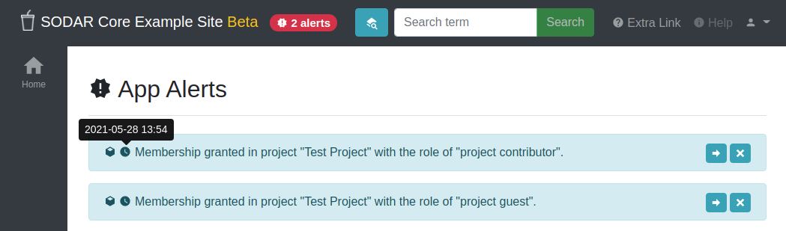

.. _app_appalerts:

Appalerts App
^^^^^^^^^^^^^

The ``appalerts`` site app enables SODAR Core apps to generate alerts for users.
The user will receive a notify about these alerts anywhere on the site even if
they are tied to a specific project.

Basics
======

The app consists of two plugins: the site app plugin for alert displaying and
the backend plugin to create and access alerts from your SODAR Core based apps.

Installation
============

.. warning::

    To install this app you **must** have the ``django-sodar-core`` package
    installed and the ``projectroles`` app integrated into your Django site.
    See the :ref:`projectroles integration document <app_projectroles_integration>`
    for instructions.

Django Settings
---------------

Add the app into ``THIRD_PARTY_APPS`` in ``config/settings/base.py`` as follows:

.. code-block:: python

    THIRD_PARTY_APPS = [
        # ...
        'adminalerts.apps.AdminalertsConfig',
    ]

Next, make sure the context processor for app alerts is included in the
``TEMPLATES`` dictionary:

.. code-block:: python

    TEMPLATES = [
        {
            'OPTIONS': {
                'context_processors': {
                    # ...
                    'projectroles.context_processors.app_alerts_processor',
                }
            }
        }

URL Configuration
-----------------

In the Django URL configuration file, add the following line under
``urlpatterns`` to include adminalerts URLs in your site.

.. code-block:: python

    urlpatterns = [
        # ...
        url(r'^alerts/app/', include('appalerts.urls')),
    ]

Migrate Database and Register Plugin
------------------------------------

To migrate the Django database and register the appalerts site app plugin,
run the following management command:

.. code-block:: console

    $ ./manage.py migrate

In addition to the database migration operation, you should see the following
output:

.. code-block:: console

    Registering Plugin for appalerts.plugins.SiteAppPlugin
    Registering Plugin for appalerts.plugins.BackendPlugin

Usage
=====

When logged in as an authenticated user, you can find the "App Alerts" option in
your user dropdown menu. This displays a list of active alerts you have in the
system. You have the possibility to dismiss alerts or follow a related link. The
latter action will also dismiss the alert.

When you are anywhere on the site, a notification about existing events will
appear on the top bar of the site.

    App alert list and title bar notification

Backend API
===========

For creation and management of alerts, it is recommended to use the backend API
to retrieve and use the plugin, without the need for hard-coded includes. The
``add_alert()`` helper is also provided to simplify alert creation. See the
accompanying API documentation for details.

.. note::

    The logic for alert life cycle management is mostly left to the app issuing
    alerts. Alerts with an accompanying project or plugin will get deleted with
    the accompanying object. Please try to make sure you will not e.g. provide
    a related URL to the event which may no longer be valid when the user
    accesses the alert.

Backend Django API Documentation
================================

This is the backend API, retrievable with
``get_backend_api('appalerts_backend')``.

.. currentmodule:: appalerts.api

.. autoclass:: AppAlertAPI
    :members:
    :show-inheritance:
