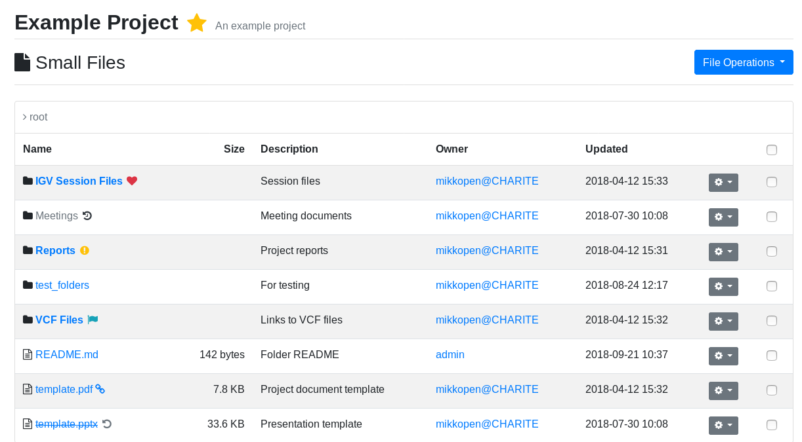

.. _app_filesfolders_usage:

Filesfolders Usage
^^^^^^^^^^^^^^^^^^

Usage instructions for the ``filesfolders`` app are detailed in this document.

Filesfolders UI
===============

You can browse and manage files in the app's main view according to your
permissions for each project. The *"File Operations"* menu is used to upload new
files as well as add new folders or links. The menu also contains batch moving
and deletion operations, for which items can be checked using the right hand
side checkboxes.

Updating/deleting operations for single items can be accessed in the dropdown
menus for each item. In the item create/update form, you can also *tag* items
with a choice of icons and stylings to represent the item status.

When uploading a .zip archive, you may choose the *"Extract files from archive"*
option to automatically extract archive files and folders into the filesfolders
app. Note that overwriting of files is not currently allowed.

    Filesfolders main view

App Settings
============

In the project create/update form, set the boolean setting
``filesfolders.allow_public_links`` true to allow providing public links to
files, for people who can access the site but do not necessarily have a user
account or project rights. Note that public link access still has to be granted
for each file through its create/update form.