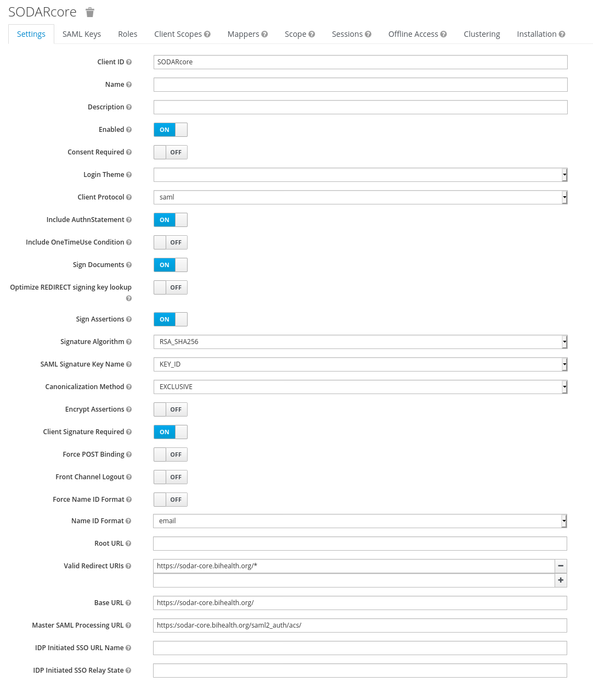
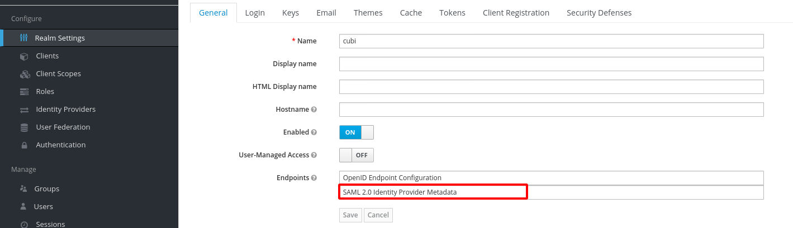
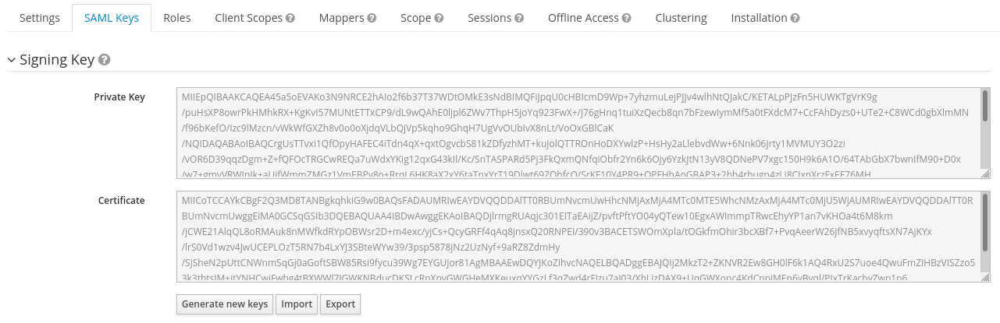
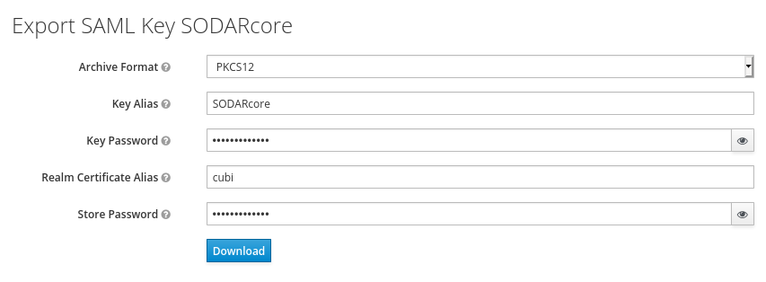

.. _app_projectroles_settings:

Projectroles Django Settings
^^^^^^^^^^^^^^^^^^^^^^^^^^^^

This document describes the :term:`Django settings` for the ``projectroles``
app, which also control the configuration of other apps in a SODAR Core based
site.

These settings are usually found in ``config/settings/*.py``, with
``config/settings/base.py`` being the default configuration other files may
override or extend.

If your site is based on ``sodar_django_site``, mandatory settings are already
set to their default values. In that case, you only need to modify or customize
them where applicable.

If you are integrating django-sodar-core with an existing Django site or
building your site from scratch without the recommended template, make sure to
add all mandatory settings into your project.

For values retrieved from environment variables, make sure to configure your
env accordingly. For development and testing, it is highly recommended to set
``DJANGO_READ_DOT_ENV_FILE=1`` in your system's environment variables and
place the env variables into a ``.env`` file in the root directory of your
Django site repository. See ``env.example`` for an example of such a file.

Site Package and Paths
======================

The site package and path configuration should be found at the beginning of the
default configuration file. Substitute {SITE_NAME} with the name of your site
package.

.. code-block:: python

    import environ
    SITE_PACKAGE = '{SITE_NAME}'
    ROOT_DIR = environ.Path(__file__) - 3
    APPS_DIR = ROOT_DIR.path(SITE_PACKAGE)

Apps
====

Apps installed from django-sodar-core are placed in ``THIRD_PARTY_APPS``. The
following apps need to be included in the list in order for SODAR Core to work:

.. code-block:: python

    THIRD_PARTY_APPS = [
        # ...
        'crispy_forms',
        'rules.apps.AutodiscoverRulesConfig',
        'djangoplugins',
        'pagedown',
        'markupfield',
        'rest_framework',
        'knox',
        'projectroles.apps.ProjectrolesConfig',
        'dal',
        'dal_select2',
    ]

Database
========

Under ``DATABASES``, the setting below is recommended:

.. code-block:: python

    DATABASES['default']['ATOMIC_REQUESTS'] = False

.. note::

    If this conflicts with your existing set up, you can modify the code in your
    other apps to use e.g. ``@transaction.atomic``.

.. note::

    This setting mostly is used for the ``sodar_taskflow`` transactions
    supported by projectroles but not commonly used, so having this setting as
    True *may* cause no issues. However, it is not officially supported at this
    time.

Templates
=========

Under ``TEMPLATES['OPTIONS']['context_processors']``, add the projectroles URLs
processor:

.. code-block:: python

    'projectroles.context_processors.urls_processor',

Email
=====

Under ``EMAIL_CONFIGURATION`` or ``EMAIL``, configure email settings:

.. code-block:: python

    EMAIL_SENDER = env('EMAIL_SENDER', default='noreply@example.com')
    EMAIL_SUBJECT_PREFIX = env('EMAIL_SUBJECT_PREFIX', default='')

Authentication
==============

``AUTHENTICATION_BACKENDS`` should contain the following backend classes:

.. code-block:: python

    AUTHENTICATION_BACKENDS = [
        'rules.permissions.ObjectPermissionBackend',
        'django.contrib.auth.backends.ModelBackend',
    ]

.. note::

    The default setup by cookiecutter-django adds the ``allauth`` package. This
    can be left out of the project if not needed, as it mostly provides adapters
    for e.g. social media account logins. If removing allauth, you can also
    remove unused settings variables starting with ``ACCOUNT_*``.

The following settings remain in your auth configuration:

.. code-block:: python

    AUTH_USER_MODEL = 'users.User'
    LOGIN_REDIRECT_URL = 'home'
    LOGIN_URL = 'login'

Django REST Framework
=====================

To enable ``djangorestframework`` API views and ``knox`` authentication, these
values should be added under ``DEFAULT_AUTHENTICATION_CLASSES``:

.. code-block:: python

    REST_FRAMEWORK = {
        'DEFAULT_AUTHENTICATION_CLASSES': (
            'rest_framework.authentication.BasicAuthentication',
            'rest_framework.authentication.SessionAuthentication',
            'knox.auth.TokenAuthentication',
        ),
    }

General Site Settings
=====================

For display in projectroles based templates, customize related variables to
describe your site. ``SITE_INSTANCE_TITLE`` may be used to e.g. differentiate
between site versions used for deployment or staging, use in different
organizations, etc.

.. code-block:: python

    SITE_TITLE = 'Name of Your Project'
    SITE_SUBTITLE = env.str('SITE_SUBTITLE', 'Beta')
    SITE_INSTANCE_TITLE = env.str('SITE_INSTANCE_TITLE', 'Deployment Instance Name')

Projectroles Settings
=====================

**Mandatory** projectroles app settings are explained below:

* ``PROJECTROLES_SITE_MODE``: Site mode for remote project metadata
  synchronization, either ``SOURCE`` (allow others to read local projects) or
  ``TARGET`` (read projects from another site)
* ``PROJECTROLES_TARGET_CREATE``: Whether or not local projects can be created
  if site is in ``TARGET`` mode. If your site is in ``SOURCE`` mode, this
  setting has no effect.
* ``PROJECTROLES_INVITE_EXPIRY_DAYS``: Days until project email invites expire
  (int)
* ``PROJECTROLES_SEND_EMAIL``: Enable/disable email sending (bool)
* ``PROJECTROLES_EMAIL_SENDER_REPLY``: Whether replies are expected to the
  sender address (bool). If set ``False`` and nothing is set in the ``reply-to``
  header, a "do not reply" note is added to the email body.
* ``PROJECTROLES_ENABLE_SEARCH``: Whether you want to enable SODAR search on
  your site (boolean)
* ``PROJECTROLES_DEFAULT_ADMIN``: User name of the default superuser account
  used in e.g. replacing an unavailable user or performing backend admin
  commands (string)

Example:

.. code-block:: python

    # Projectroles app settings
    PROJECTROLES_SITE_MODE = env.str('PROJECTROLES_SITE_MODE', 'TARGET')
    PROJECTROLES_TARGET_CREATE = env.bool('PROJECTROLES_TARGET_CREATE', True)
    PROJECTROLES_INVITE_EXPIRY_DAYS = env.int('PROJECTROLES_INVITE_EXPIRY_DAYS', 14)
    PROJECTROLES_SEND_EMAIL = env.bool('PROJECTROLES_SEND_EMAIL', False)
    PROJECTROLES_EMAIL_SENDER_REPLY = env.bool('PROJECTROLES_EMAIL_SENDER_REPLY', False)
    PROJECTROLES_ENABLE_SEARCH = True
    PROJECTROLES_DEFAULT_ADMIN = env.str('PROJECTROLES_DEFAULT_ADMIN', 'admin')

Optional Projectroles Settings
==============================

The following projectroles settings are **optional**:

* ``PROJECTROLES_SECRET_LENGTH``: Character length of secret token used in
  projectroles (int)
* ``PROJECTROLES_SEARCH_PAGINATION``: Amount of search results per each app to
  display on one page (int)
* ``PROJECTROLES_HELP_HIGHLIGHT_DAYS``: Days for highlighting tour help for new
  users (int)
* ``PROJECTROLES_DISABLE_CATEGORIES``: If set True, disable categories and only
  allow a list of projects on the root level (boolean) (see note)
* ``PROJECTROLES_HIDE_APP_LINKS``: Apps hidden from the project sidebar and
  dropdown menus for non-superusers. The app views and URLs are still
  accessible. The names should correspond to the ``name`` property in each
  project app's plugin (list)
* ``PROJECTROLES_DELEGATE_LIMIT``: The number of delegate roles allowed per
  project. The amount is limited to 1 per project if not set, unlimited if set
  to 0. Will be ignored for remote projects synchronized from a source site
  (int)
* ``PROJECTROLES_BROWSER_WARNING``: If true, display a warning to users using
  Internet Explorer (bool)
* ``PROJECTROLES_ALLOW_LOCAL_USERS``: If true, roles for local non-LDAP users
  can be synchronized from a source during remote project sync if they exist on
  the target site. Similarly, local users will be selectable in member dropdowns
  when selecting users (bool)
* ``PROJECTROLES_KIOSK_MODE``: If true, allow accessing certain project views
  *without* user authentication in order to e.g. demonstrate features in a
  kiosk-style deployment. Also hides and/or disables views not intended to be
  used in this mode (bool)

Example:

.. code-block:: python

    # Projectroles app settings
    # ...
    PROJECTROLES_SECRET_LENGTH = 32
    PROJECTROLES_SEARCH_PAGINATION = 5
    PROJECTROLES_HELP_HIGHLIGHT_DAYS = 7
    PROJECTROLES_DISABLE_CATEGORIES = True
    PROJECTROLES_HIDE_APP_LINKS = ['filesfolders']
    PROJECTROLES_DELEGATE_LIMIT = 1
    PROJECTROLES_BROWSER_WARNING = True
    PROJECTROLES_ALLOW_LOCAL_USERS = True
    PROJECTROLES_KIOSK_MODE = False

.. warning::

    Regarding ``PROJECTROLES_DISABLE_CATEGORIES``: In the current SODAR core
    version remote site access and remote project synchronization are disabled
    if this option is used! Use only if a simple project list is specifically
    required in your site.

.. warning::

    Regarding ``PROJECTROLES_ALLOW_LOCAL_USERS``: Please note that this will
    allow synchronizing project roles to local non-LDAP users based on their
    **user name**. You should personally ensure that the users in question are
    authorized for these roles. Furthermore, only roles for **existing** local
    users will be synchronized. New local users will have to be added manually
    through the Django admin or shell on the target site.

.. warning::

    The ``PROJECTROLES_KIOSK_MODE`` setting is under development and considered
    experimental. More implementation, testing and documentation is forthcoming.

Backend App Settings
====================

The ``ENABLED_BACKEND_PLUGINS`` settings lists backend plugins implemented using
``BackendPluginPoint`` which are enabled in the configuration. For more
information see :ref:`dev_backend_app`.

.. code-block:: python

    ENABLED_BACKEND_PLUGINS = env.list('ENABLED_BACKEND_PLUGINS', None, [])

API View Settings (Optional)
============================

If you want to build an API to your site using SODAR Core functionality, it is
recommended to base your API views on ``projectroles.views.SODARAPIBaseView``.
Using this base class also allows you to define your API media type, version
number and allowed versions via Django settings.

The recommended API setup uses accept header versioning. The
``SODAR_API_MEDIA_TYPE`` setting should be changed to your organization and API
identification if API views are introduced. The ``SODAR_API_DEFAULT_HOST``
setting should post to the externally visible host of your server and be
configured in your environment settings.

These settings are **optional**. Default values will be used if they are unset.

Example:

.. code-block:: python

    SODAR_API_DEFAULT_VERSION = '0.1'
    SODAR_API_ACCEPTED_VERSIONS = [SODAR_API_DEFAULT_VERSION]
    SODAR_API_MEDIA_TYPE = 'application/your.application+json'  # Change this
    SODAR_API_DEFAULT_HOST = SODAR_API_DEFAULT_HOST = env.url('SODAR_API_DEFAULT_HOST', 'http://0.0.0.0:8000')

LDAP/AD Configuration (Optional)
================================

If you want to utilize LDAP/AD user logins as configured by projectroles, you
can add the following configuration. Make sure to also add the related env
variables to your configuration.

This part of the setup is **optional**.

.. note::

    In order to support LDAP, make sure you have installed the dependencies from
    ``utility/install_ldap_dependencies.sh`` and ``requirements/ldap.txt``! For
    more information see :ref:`dev_sodar_core`.

.. note::

    If only using one LDAP/AD server, you can leave the "secondary LDAP server"
    values unset.

.. code-block:: python

    ENABLE_LDAP = env.bool('ENABLE_LDAP', False)
    ENABLE_LDAP_SECONDARY = env.bool('ENABLE_LDAP_SECONDARY', False)

    if ENABLE_LDAP:
        import itertools
        import ldap
        from django_auth_ldap.config import LDAPSearch

        # Default values
        LDAP_DEFAULT_CONN_OPTIONS = {ldap.OPT_REFERRALS: 0}
        LDAP_DEFAULT_FILTERSTR = '(sAMAccountName=%(user)s)'
        LDAP_DEFAULT_ATTR_MAP = {
            'first_name': 'givenName',
            'last_name': 'sn',
            'email': 'mail',
        }

        # Primary LDAP server
        AUTH_LDAP_SERVER_URI = env.str('AUTH_LDAP_SERVER_URI', None)
        AUTH_LDAP_BIND_DN = env.str('AUTH_LDAP_BIND_DN', None)
        AUTH_LDAP_BIND_PASSWORD = env.str('AUTH_LDAP_BIND_PASSWORD', None)
        AUTH_LDAP_CONNECTION_OPTIONS = LDAP_DEFAULT_CONN_OPTIONS

        AUTH_LDAP_USER_SEARCH = LDAPSearch(
            env.str('AUTH_LDAP_USER_SEARCH_BASE', None),
            ldap.SCOPE_SUBTREE,
            LDAP_DEFAULT_FILTERSTR,
        )
        AUTH_LDAP_USER_ATTR_MAP = LDAP_DEFAULT_ATTR_MAP
        AUTH_LDAP_USERNAME_DOMAIN = env.str('AUTH_LDAP_USERNAME_DOMAIN', None)
        AUTH_LDAP_DOMAIN_PRINTABLE = env.str(
            'AUTH_LDAP_DOMAIN_PRINTABLE', AUTH_LDAP_USERNAME_DOMAIN
        )

        AUTHENTICATION_BACKENDS = tuple(
            itertools.chain(
                ('projectroles.auth_backends.PrimaryLDAPBackend',),
                AUTHENTICATION_BACKENDS,
            )
        )

        # Secondary LDAP server (optional)
        if ENABLE_LDAP_SECONDARY:
            AUTH_LDAP2_SERVER_URI = env.str('AUTH_LDAP2_SERVER_URI', None)
            AUTH_LDAP2_BIND_DN = env.str('AUTH_LDAP2_BIND_DN', None)
            AUTH_LDAP2_BIND_PASSWORD = env.str('AUTH_LDAP2_BIND_PASSWORD', None)
            AUTH_LDAP2_CONNECTION_OPTIONS = LDAP_DEFAULT_CONN_OPTIONS

            AUTH_LDAP2_USER_SEARCH = LDAPSearch(
                env.str('AUTH_LDAP2_USER_SEARCH_BASE', None),
                ldap.SCOPE_SUBTREE,
                LDAP_DEFAULT_FILTERSTR,
            )
            AUTH_LDAP2_USER_ATTR_MAP = LDAP_DEFAULT_ATTR_MAP
            AUTH_LDAP2_USERNAME_DOMAIN = env.str('AUTH_LDAP2_USERNAME_DOMAIN')
            AUTH_LDAP2_DOMAIN_PRINTABLE = env.str(
                'AUTH_LDAP2_DOMAIN_PRINTABLE', AUTH_LDAP2_USERNAME_DOMAIN
            )

            AUTHENTICATION_BACKENDS = tuple(
                itertools.chain(
                    ('projectroles.auth_backends.SecondaryLDAPBackend',),
                    AUTHENTICATION_BACKENDS,
                )
            )

SAML SSO Configuration (optional)
=================================

Optional Single Sign-On (SSO) authorization via SAML is also available. To
enable this feature, set ``ENABLE_SAML=1`` in your environment. Configuring SAML
for SSO requires proper configuration of the Keycloak SSO server and the SAML
client library.

Keycloak
--------

Create a new client in Keycloak and configure it as follows. Please note that
**Client ID** can be chosen however you like, but it must match the setting
in the client.

To generate the ``metadata.xml`` file required for the client, go to the
**Realm Settings** page and in the **General** tab, click ``SAML 2.0 Identity Provider Metadata``
to download the xml data. Save it somewhere on the client, the preferred name is ``metadata.xml``.

For the signing of the request send to the Keycloak server you will require a certificate and
key provided by the Keycloak server and incorporated into the configuration of the client.
Switch to the ``SAML Keys``. Make sure to select ``PKCS12`` as **Archive Format**.

Convert the archive on the commandline with the follow command and store them in some place
on your client.

.. code::

    openssl pkcs12 -in keystore.p12 -password "pass:<PASSWORD>" -nodes | openssl x509 -out cert.pem
    openssl pkcs12 -in keystore.p12 -password "pass:<PASSWORD>" -nodes -nocerts | openssl rsa -out key.pem

SODAR Core
----------

Make sure that your ``config/settings/base.py`` contains the following
configuration:

.. code-block:: python

    ENABLE_SAML = env.bool('ENABLE_SAML', False)
    SAML2_AUTH = {
        # Required setting
        'SAML_CLIENT_SETTINGS': {  # Pysaml2 Saml client settings (https://pysaml2.readthedocs.io/en/latest/howto/config.html)
            'entityid': env.str(
                'SAML_CLIENT_ENTITY_ID', 'SODARcore'
            ),  # The optional entity ID string to be passed in the 'Issuer' element of authn request, if required by the IDP.
            'entitybaseurl': env.str(
                'SAML_CLIENT_ENTITY_URL', 'https://localhost:8000'
            ),
            'metadata': {
                'local': [
                    env.str(
                        'SAML_CLIENT_METADATA_FILE', 'metadata.xml'
                    ),  # The auto(dynamic) metadata configuration URL of SAML2
                ],
            },
            "service": {
                'sp': {
                    'idp': env.str(
                        'SAML_CLIENT_IPD',
                        'https://sso.hpc.bihealth.org/auth/realms/cubi',
                    ),
                    # Keycloak expects client signature
                    'authn_requests_signed': 'true',
                    # Enforce POST binding which is required by keycloak
                    'binding': 'urn:oasis:names:tc:SAML:2.0:bindings:HTTP-POST',
                },
            },
            'key_file': env.str('SAML_CLIENT_KEY_FILE', 'key.pem'),
            'cert_file': env.str('SAML_CLIENT_CERT_FILE', 'cert.pem'),
            'xmlsec_binary': env.str('SAML_CLIENT_XMLSEC1', '/usr/bin/xmlsec1'),
            'encryption_keypairs': [
                {
                    'key_file': env.str('SAML_CLIENT_KEY_FILE', 'key.pem'),
                    'cert_file': env.str('SAML_CLIENT_CERT_FILE', 'cert.pem'),
                }
            ],
        },
        'DEFAULT_NEXT_URL': '/',  # Custom target redirect URL after the user get logged in. Default to /admin if not set. This setting will be overwritten if you have parameter ?next= specificed in the login URL.
        # # Optional settings below
        # 'NEW_USER_PROFILE': {
        #     'USER_GROUPS': [],  # The default group name when a new user logs in
        #     'ACTIVE_STATUS': True,  # The default active status for new users
        #     'STAFF_STATUS': True,  # The staff status for new users
        #     'SUPERUSER_STATUS': False,  # The superuser status for new users
        # },
        # 'ATTRIBUTES_MAP': {  # Change Email/UserName/FirstName/LastName to corresponding SAML2 userprofile attributes.
        #     'email': 'Email',
        #     'username': 'UserName',
        #     'first_name': 'FirstName',
        #     'last_name': 'LastName',
        # },
        # 'TRIGGER': {
        #     'FIND_USER': 'path.to.your.find.user.hook.method',
        #     'NEW_USER': 'path.to.your.new.user.hook.method',
        #     'CREATE_USER': 'path.to.your.create.user.hook.method',
        #     'BEFORE_LOGIN': 'path.to.your.login.hook.method',
        # },
        # 'ASSERTION_URL': 'https://cubi5.bihealth.org:8000',  # Custom URL to validate incoming SAML requests against
    }

Add the following settings to your environment variables:

.. code-block::

    ENABLE_SAML=1
    SAML_CLIENT_ENTITY_ID=<Entity ID configured in Keycloak>
    SAML_CLIENT_ENTITY_URL=<Client URL, e.g. https://sodar-core.bihealth.org>
    SAML_CLIENT_METADATA_FILE=<e.g. metadata.xml>
    SAML_CLIENT_IPO=<SSO server URL, e.g. https://sso.hpc.bihealth.org/auth/realms/cubi>
    SAML_CLIENT_KEY_FILE=<e.g. key.pem>
    SAML_CLIENT_CERT_FILE=<e.g. cert.pem>
    SAML_CLIENT_XMLSEC1=<e.g. /usr/bin/xmlsec1>

Global JS/CSS Include Modifications (Optional)
==============================================

It is possible to supplement (or replace, see below) global Javascript and CSS
includes of your SODAR Core site without altering the base template. You can
place a list of custom includes into the list variables
``PROJECTROLES_CUSTOM_JS_INCLUDES`` and ``PROJECTROLES_CUSTOM_CSS_INCLUDES``.
These can either be local static file paths or web URLs to e.g. CDN served
files.

If using the default CDN imports for JQuery, Bootstrap4 etc. are not an optimal
solution in your use case due to e.g. network issues, you can disable these
includes by setting ``PROJECTROLES_DISABLE_CDN_INCLUDES`` to ``True``.

.. warning::

    If disabling the default CDN includes, you **must** provide replacements for
    **all** disabled files in your custom includes. Otherwise your SODAR Core
    based site will not function correctly!

Example:

.. code-block:: python

    PROJECTROLES_DISABLE_CDN_INCLUDES = True
    PROJECTROLES_CUSTOM_JS_INCLUDES = [
        STATIC_ROOT + '/your/path/jquery-3.3.1.min.js',
        STATIC_ROOT + '/your/path/popper.min.js',
        'https://some-cdn.com/bootstrap.min.js',
        # ...
    ]
    PROJECTROLES_CUSTOM_CSS_INCLUDES = [
        STATIC_ROOT + '/your/path/bootstrap.min.css',
        STATIC_ROOT + '/your/path/font-awesome.min.css',
        # ...
    ]

Modifying SODAR_CONSTANTS (Optional)
====================================

String identifiers used globally in SODAR project management are defined in the
``SODAR_CONSTANTS`` dictionary. It can be imported into your app code with the
import:

.. code-block:: python

    from projectroles.models import SODAR_CONSTANTS

If you need to update or extend the constants for use your site, you can import
the default dictionary into your Django settings and modify it as necessary with
the following snippet:

.. code-block:: python

    from projectroles.constants import get_sodar_constants
    SODAR_CONSTANTS = get_sodar_constants(default=True)
    # Your changes here..

.. warning::

    Modifying existing default constants may result in unwanted issues,
    especially on a site which already contains created projects. Proceed with
    caution!

Logging (Optional)
==================

It is recommended to add "projectroles" under ``LOGGING['loggers']``. For
production, ``INFO`` debug level is recommended.
