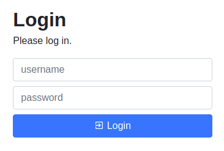
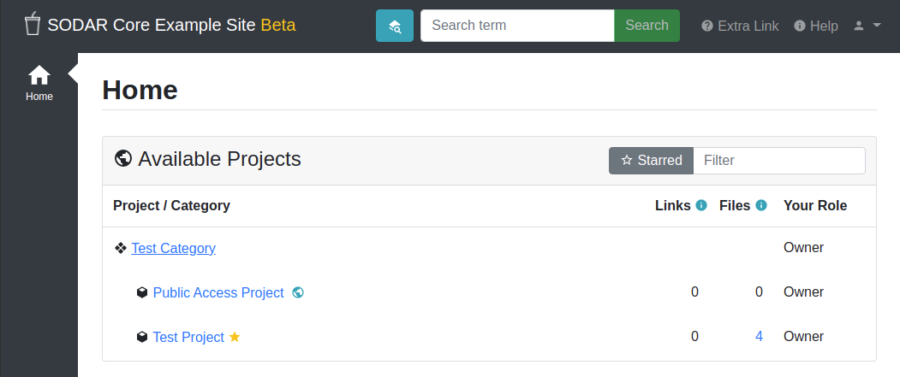
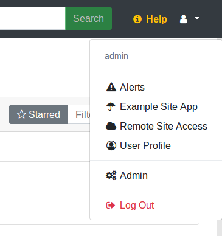
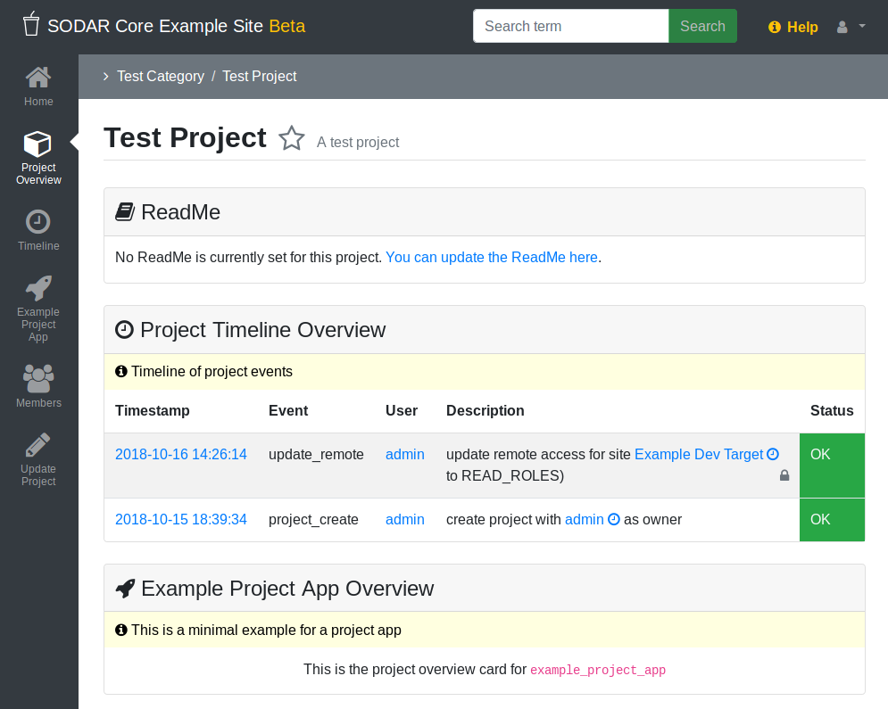
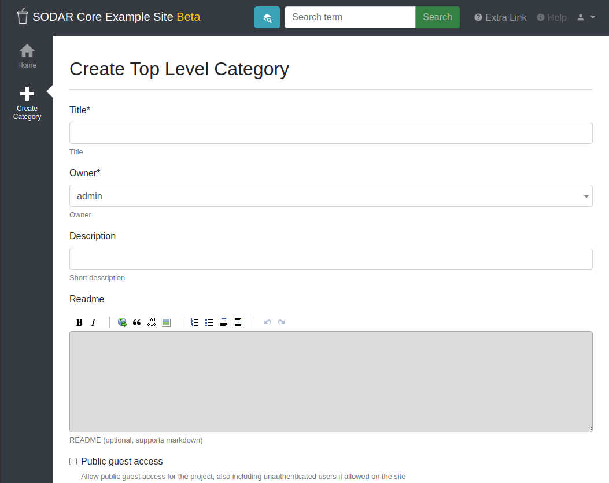
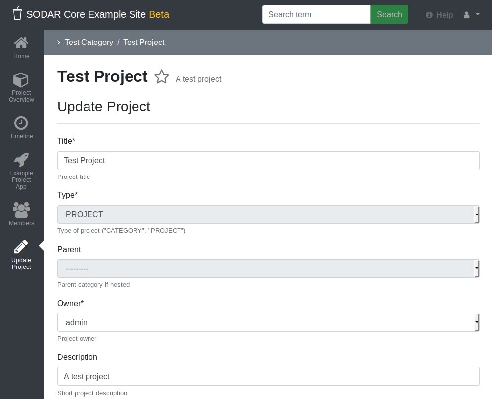
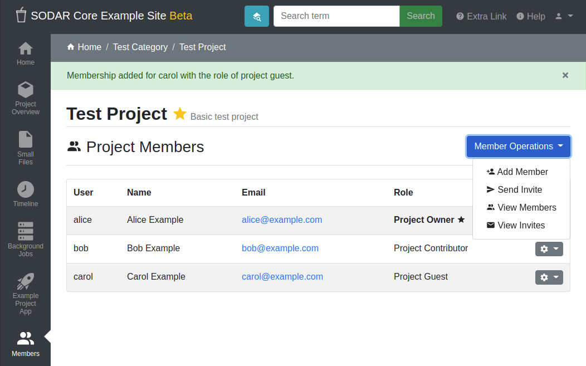
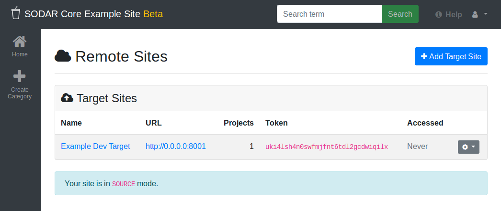
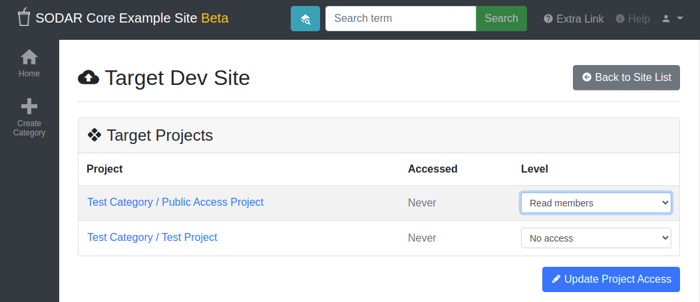

.. _app_projectroles_usage:

Projectroles Usage
^^^^^^^^^^^^^^^^^^

This document provides instructions for using the ``projectroles`` app which has
been integrated into your Django site.

.. hint::

    Detailed instructions for many pages can be found in an interactive tour by
    clicking the "Help" link in the right side of the top navigation bar.

Before reading this document, be sure to see :ref:`app_projectroles_basics` for
basic concepts regarding the use of this app.

Logging In
==========

Apart from specific public or token-enabled views, user login is **mandatory**
for using a SODAR Core based Django site.

One can either log in using a local Django user or, if LDAP/AD is enabled, their
LDAP/AD credentials from a supported site. In the latter case, the user domain
must be appended to the user name in form of ``user@DOMAIN``.

    SODAR login form

User Interface
==============

Basics
------

Upon loggin into a SODAR Core based Django site using default templates and CSS,
the general view of your site is split into the following elements:

- **Top navigation bar**: Contains the site logo and title, search element,
  help link and the user dropdown menu.
- **User dropown menu**: Contains links to user management, admin site and
  site-wide apps the user has access to.
- **Project sidebar**: Shortcuts to project apps and project management pages
- **Project navigation**: Project structure breadcrumb (disabled for site apps)
- **Content**: Actual app content goes in this element
- **Footer**: Optional footer with e.g. site info and version

    Home view

    User dropdown

Home View
---------

As content within a SODAR Core based site is by default sorted into projects,
the home view displays a tree view of categories and projects to choose from.
You can filter the list with a search term or restrict display to your starred
projects.

Project Detail View
-------------------

The project detail page dynamically imports elements from installed project
apps, usually showing e.g. overview of latest additions to app data, statistics
and/or shortcuts to app functionalities. Here you can also access project apps
from the project sidebar. For project apps, the sidebar link leads to the app
entry point view as defined in the app plugin.

For each page in a project app which extends the default projectroles template
layout, the **project title bar** is displayed on the top of the page. This
contains the project title and description and a link to "star" the project into
your favourites. Below this, the **project app title bar** with possible
app-specific controls is usually displayed.

    Project detail view

Category and Project Management
===============================

In SODAR based sites, data is split into **categories** and **projects**.
Categories may be freely nested and are used as containers of projects. They
may contain a description and readme, but project apps are disabled for
categories unless explicitly enabled. Projects can not be nested within each
other.

Creating a Top Level Category
-----------------------------

Currently, only users with a superuser status can create a top level category.
This can be done by navigating to the *home view* and clicking the
**Create Category** link. To create a category, a name and owner must be
supplied, along with optional description and/or a readme document. All of these
may be modified later.

.. note::

    Currently, only users already previously logged into the system can be added
    as the owner of a category or project. The ability to invite users not yet
    on the site as owners will be added later.

.. hint::

    When setting up a new site, think about what kind of category and project
    structure makes sense for your team and organization. Moving projects and
    categories under different categories is possible, but is not recommended
    and can currently only be done via the admin view or directly in the Django
    shell.

    Category/project creation form

Creating Projects
-----------------

Once navigating into a category, a user with sufficient access will see the
**Create Project or Category** link in the side bar. This opens up a form for
adding a project or a nested category under the current category. The form is
identical to top level category creation, except that you can also choose
between creating a project or a category.

Users with the role of *project contributor* or higher in a category are allowed
to create a project within that category.

Updating Projects
-----------------

An existing project or category can be updated from the
**Update Project/Category** link in the side bar. Again, a similar form as
before will be presented to the user. The owner can not be changed here, but
must be modified in the *Members* view instead. It is possible to move the
current category or project under another category by altering the ``parent``
field. The user who does the updating must have a sufficient role in the
target category or superuser status.

    Category/project updating form

.. note::

    For remote project synchronized from another SODAR Core based site, you can
    only edit local application settings in this view.

App Settings
------------

Project and site apps may define :term:`app settings`, which can be either be
set with the scope of *project*, *user* or *user within a project*.

Widgets for project specific settings will show up in the project creation and
updating form and can only be modified by users with sufficient project access.
User specific settings will be displayed in the
:ref:`Userpforile app <app_userprofile>`.

By defining the attribute ``user_modifiable=False``, project or user app
settings will not be shown in the respective project/user update views. This is
used e.g. in cases where a project app provides its own UI or updates some
"hidden" setting due to user actions. Superusers will still see these hidden
settings in the Update Project view.

Settings with the scope of user within a project do not currently have a
separate UI of their own. Instead, project apps can produce their own user
specific UIs for this functionality if manual user selection is needed.

.. note::

    Currently, project specific app settings are also enabled for categories but
    do not actually do anything. The behaviour regarding this (remove settings /
    inherit by nested projects / etc) is TBD.

The projectroles app provides the following built-in app settings with the
project scope:

- ``ip_restrict``: Restict project access by an allowed IP list if enabled.
- ``ip_allowlist``: List of allowed IP addresses for project access.

To clean up settings which have been stored in the database but have since
been removed from the plugin app settings definitions, run the following
management command:

.. code::

    $ ./manage.py cleanappsettings

Member Management
=================

Project member roles can be viewed and modified through the **Members**
link on the sidebar. Modification requires a sufficient role in the project or
category (owner or delegate) or superuser status.

    Project member list view

.. note::

    Owners of categories automatically inherit owner rights to projects
    placed under those categories, starting in SODAR Core v0.8.0. Adding
    separate roles for those users in the inherited projects is not allowed.

.. note::

    At this time, category memberships are not automatically propagated to
    projects created under the category. An inheritance functionality may be
    implemented at a later date.

Adding Members
--------------

There are two ways to add new members to a project or a category:

- **Add Member** is used to add member roles to system users.
- **Invite Member** is used to send email invites to users not yet registered
  in the system.

Addition or modification of users sends an email notification to the user in
question if email sending is enabled on your Django server. The emails can be
previewed in corresponding forms.

.. hint::

    As of SODAR Core v0.4.5, it is also possible to create an invite in the "add
    member" form. Inviting is enabled when inputting an email address not found
    among the system users.

Modifying Members
-----------------

Changing or removing user roles can be done from links next to each role on the
member list. Category or project ownership can be transferred to another user
who currently has a role in the project by using the dropdown next to the owner
role.

Invites
-------

Invites are accepted by the responding user clicking on a link supplied in their
invite email and logging in to the site with their LDAP/AD credentials. Invites
expire after a certain time and can be reissued or revoked on the
**Project Invites** page.

Remote Projects
===============

It is possible to sync project metadata and member roles between multiple SODAR
Core based Django sites. Remote sites and access can be managed in the
**Remote Site Access** site app, found in the user dropdown menu in the top
navigation bar.

Alternatively, remote sites can be created using the following management
command:

.. code-block:: console

    $ ./manage.py addremotesite

In the current implementation, your django site must either be in **source** or
**target** mode. A source site can define one or multiple target sites where
project data can be provided. A target site can define exactly one source site,
from which project data can be retrieved from.

.. note::

    These are arbitrary restrictions which may be relaxed in the future, if use
    cases warrant it.

To enable remote project data reading, you must first set up either a target
or a source site depending on the role of your own SODAR site.

    Remote site list in source mode

As Source Site
--------------

Navigate to the **Remote Site Access** site app and click on the
*Add Target Site* link. You will be provided with a form for specifying the
remote site. A secret string is generated automatically and you need to provide
this to the administrator of the target site in question for accessing your
site.

Here you also have the option to hide the remote project link from your users.
Users viewing the project on the source site then won't see a link to the target
site. Owners and Superusers will still see the link (greyed out). This is most
commonly used for internal test sites which only needs to be used by admins.

Once created, you can access the list of projects on your site in regards to the
created target site. For each project, you may select an access level, of which
three are currently implemented:

- **No access**: No access on the remote site (default)
- **Read roles**: This allows for the target site to read project metadata *and*
  user roles in order to synchronize project access remotely.
- **Revoked access**: Previously available access which has been revoked. The
  project will still remain in the target site, but only superusers, the project
  owner or the project delegate(s) can acesss it.

.. note::

    The *read roles* access level also provides metadata of the categories above
    the selected project so that the project structure can be maintained.

.. note::

    Only LDAP/AD user roles and local administrator *owner* roles are provided
    to the target site. Other local user roles are ignored.

.. note::

    Access levels for purely checking the existence of the project and only
    reading project metadata (title, description..) without member roles are
    implemented in the data model and backend, but currently disabled in the UI.

Once desired access to specific projects has been granted and confirmed, the
target site will sync the data by sending a request to the source site.

    Remote project list in source mode

As Target Site
--------------

The source site should be set up as above using the *Set Source Site* link,
using the provided secret string as the access token.

After creating the source site, remote project metadata and member roles (for
which access has been granted) can be accessed using the *Synchronize* link.
Additionaly if the remote Source site is synchronized with multiple Target Sites,
information about those other Target sites will be synchronized as well an displayed
as *Peer Sites*.

Alternatively, the following management command can be used:

.. code-block:: console

    $ ./manage.py syncremote

.. note::

    Creating local projects under a category synchronized from a remote source
    site is **not** allowed from v0.8.3 onwards. For having local projects on a
    target site, you should create and use a local root category.

.. note::

    If a local user is the owner of a synchronized project on the source site,
    the user defined in the ``PROJECTROLES_DEFAULT_ADMIN`` will be given the
    owner role. Hence you **must** have this setting defined if you are
    implementing a SODAR site in target mode.

Search
======

The search form is displayed in the top navigation bar if enabled. It currently
takes one string as a search parameter, followed by optional keyword argument.
At this time, the keyword of ``type`` has been implemented, used to limit the
search to a certain data type as specified in app plugins.

Search results are split into results from different apps. For example, entering
``test`` will return all objects from all apps containing this string.
Alternatively, entering ``test type:project`` will provide results from any app
configured to produce results of type *project*. By default, this will result in
the projectroles app listing projects which contain the search string in their
name and/or description.

.. note::

    Multiple search terms, complex search strings, full-text search and
    additional keywords/operators will be defined in the future.

REST API
========

Several SODAR Core functionalities are also available via a HTTP REST API
starting in version 0.8. See :ref:`app_projectroles_api_rest` for instructions
on REST API usage.
