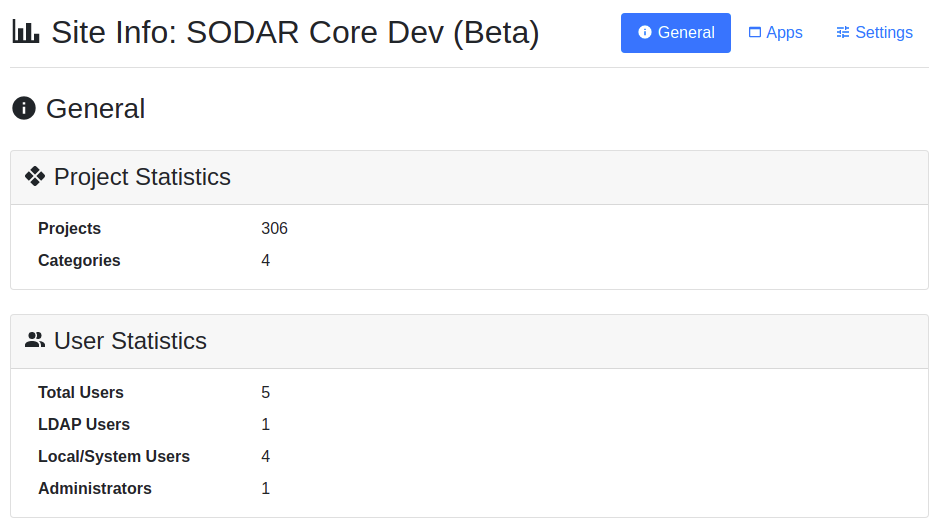

.. _app_siteinfo:

Siteinfo App
^^^^^^^^^^^^

The ``siteinfo`` site app enables system administrators and developers to view
site details and statistics gathered from project and backend apps.

Basics
======

The app renders a site which displays information and statistics regarding the
site and installed SODAR apps. Providing app statistics for siteinfo done via
implementing the ``get_statistics()`` function in your app plugins. Currently,
access to the app is limited to site administrators.

Installation
============

.. warning::

    To install this app you **must** have the ``django-sodar-core`` package
    installed and the ``projectroles`` app integrated into your Django site.
    See the :ref:`projectroles integration document <app_projectroles_integration>`
    for instructions.

Django Settings
---------------

The siteinfo app is available for your Django site after installing
``django-sodar-core``. Add the app into ``THIRD_PARTY_APPS`` as follows:

.. code-block:: python

    THIRD_PARTY_APPS = [
        # ...
        'siteinfo.apps.SiteinfoConfig',
    ]

URL Configuration
-----------------

In the Django URL configuration file, add the following line under
``urlpatterns`` to include siteinfo URLs in your site.

.. code-block:: python

    urlpatterns = [
        # ...
        url(r'^siteinfo/', include('siteinfo.urls')),
    ]

Migrate Database and Register Plugin
------------------------------------

To migrate the Django database and register the siteinfo site app plugin,
run the following management command:

.. code-block:: console

    $ ./manage.py migrate

In addition to the database migration operation, you should see the following
output:

.. code-block:: console

    Registering Plugin for siteinfo.plugins.SiteAppPlugin

Usage
=====

When logged in as a superuser, you can find the "Site Info" link in your user
dropdown menu in the top right corner of the site. This application is only
available for users with superuser status.

The UI is presented under three tabs:

General
    General site information along with statistics provided by the
    ``get_statistics()`` methods implemented in app plugins.
Apps
    List of installed and enabled project, site and backend app plugins.
Settings
    Django settings for the site. Contains settings from apps as specified in
    the ``info_settings`` member variable in the app plugin.

    Siteinfo application with the General tab selected

Providing App Statistics
------------------------

In your project app or backend plugin, implement the ``get_statistics()``
method. It should return a dictionary containing, for each statistics item, a
program friendly key and certain member fields:

``label``
    Human readable label for the statistics item.
``value``
    The value to be rendered.
``url``
    The url to link to from the value for additional information (optional).
``description``
    Additional information (optional).

Example:

.. code-block:: python

    def get_statistics(self):
        return {
            'stat_id': {
                'label': 'Some statistic',
                'value': 9000,
                'url': reverse('home'),
                'description': 'More information here',
            }
        }

Providing Site Settings
-----------------------

The site settings to be presented in the :guilabel:`Settings` tab should be
provided as a list in the ``info_settings`` variable of the app plugin.

Example:

.. code-block:: python

    info_settings = [
        'FILESFOLDERS_LINK_BAD_REQUEST_MSG',
        'FILESFOLDERS_MAX_ARCHIVE_SIZE',
        'FILESFOLDERS_MAX_UPLOAD_SIZE',
        'FILESFOLDERS_SERVE_AS_ATTACHMENT',
        'FILESFOLDERS_SHOW_LIST_COLUMNS',
    ]

.. warning::

    For information security, we recommend against including settings containing
    secret values such as passwords to be displayed in the siteinfo app.
