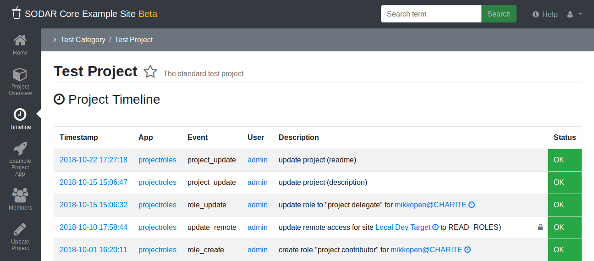

.. _app_timeline_usage:

Timeline Usage
^^^^^^^^^^^^^^

Usage instructions for the ``timeline`` app are detailed in this document.

Timeline UI
===========

You can browse events by navigating to a project or a category and selecting the
"Timeline" app from the project sidebar.

By clicking on the time stamp for each event, you can see details of the event
execution (in case of e.g. asynchronous events).

By clicking on the clock icon next to an object link in the event description,
you can view the event history of that object. The link itself will take you
to the relevant view for the object on your Django site.

Certain events have a file icon in their description. If clicked,
a popup showing a collection of extra data for the given event will appear.
It will show the extra data of the event itself and of the different states the event went through, if there are any.

Admin users are able to see certain *"classified"* level events hidden from
normal users.

    Timeline event list view

Backend API for Event Logging
=============================

The Django backend API for logging events is located in ``timeline.api``. For
the full documentation, see `here <app_timeline_api_django>`_.

Invoking the API
----------------

The API is accessed through a backend plugin. This means you can write calls to
the API without any hard-coded imports and your code should work even if the
timeline app has not been installed on the site.

The most common use case is to save events within the Class-Based Views of your
Django site, but technically this can be done by any part of the code in your
Django apps.

Initialize the API using ``projectroles.plugins.get_backend_api()`` as follows:

.. code-block:: python

    from projectroles.plugins import get_backend_api
    timeline = get_backend_api('timeline_backend')

    if timeline:    # Only proceed if the backend was successfully initialized
        pass        # Save your events here..

Adding an Event
---------------

Once you can access the timeline backend, add the event with
``timeline.add_event()``. A minimal example is as follows:

.. code-block:: python

    tl_event = timeline.add_event(
        project=project,            # Project object
        app_name=APP_NAME,          # Name of the current app
        user=request.user,          # The user triggering the activity being saved
        event_name='some_event',    # You can define these yourself, not unique
        description='Description')  # Human readable description

Linking an Object
-----------------

Say you want to link a Django model object to the event for tracking its
history? In this example, let's say it's a SODAR Core compatible ``User`` model
object ``user_obj``.

.. note::

    The given object **must** contain an ``sodar_uuid`` field with an
    auto-generated UUID. For more information, see the
    :ref:`project app development document <dev_project_app>`.

Create the event as in the previous section, but add a label ``target_user`` in
the description. The name of the label is arbitrary:

.. code-block:: python

    tl_event = timeline.add_event(
        project=project,
        app_name=APP_NAME,
        user=request.user,
        event_name='some_event',
        description='Do something to {target_user}')

All you have to do is add an object reference to the created event:

.. code-block:: python

    obj_ref = tl_event.add_object(
        obj=user_obj,
        label='target_user',
        name=user_obj.username)

The ``name`` field specifies which name the object will be referred to when
displaying the event description to a user.

Defining Object References
--------------------------

The example before is all fine and good for a ``User`` object, but what about
your own custom Django model?

When encountering an unknown object model from your app, timeline will call the
``get_object_link()`` function in the ``ProjectAppPlugin`` defined for your app.
Make sure to implement it for all the relevant models in your app.

Displaying Object Links
-----------------------

In order to display object links with timeline history link included, you can
use the ``timeline.api.get_object_link()`` function in your app's template tags.

Defining Status States
----------------------

.. note::

    If your Django apps only deal with normal synchronous requests, you don't
    need to pay attention to this functionality right now.

By default, ``timeline.add_event()`` treats events as synchronous and
automatically saves them with the status of ``OK``. However, in case of e.g.
asynchronous requests, you can alter this by setting the ``status_type`` and
(optionally) ``status_desc`` types upon creation.

.. code-block:: python

    tl_event = timeline.add_event(
        project=project,
        app_name=APP_NAME,
        user=request.user,
        event_name='some_event',
        description='Description',
        status_type='SUBMIT',
        status_desc='Just submitted this')

After that, you can add new status states for the event using the object
returned by ``timeline.add_event()``:

.. code-block:: python

    tl_event.set_status('OK', 'Submission was successful!')

Currently supported status types are listed below, some only applicable to async
events:

- ``OK``: All OK, event successfully performed
- ``INFO``: Used for events which do not change anything, e.g. viewing something
  within an app
- ``INIT``: Initializing the event in progress
- ``SUBMIT``: Event submitted asynchronously
- ``FAILED``: Asynchronous event submission failed
- ``CANCEL``: Event cancelled

Extra Data
----------

Extra data can be added in the JSON format for both events and their status
states with the ``extra_data`` and ``status_extra_data`` parameters.

Speciying a label ``{extra-NAME}`` in the event description will lead to a
callback to ``get_extra_data_link()`` in the app plugin. To support this you
need to make sure to implement the ``get_extra_data_link()`` function in your
plugin.

Classified Events
-----------------

To mark an event *"classified"*, that is, restricting its visibility to project
owners and admins, set the ``classified`` argument to true when invoking
``timeline.add_event()``.

.. note::

    Multiple levels of classification may be introduced to the timeline event
    model in the future.
