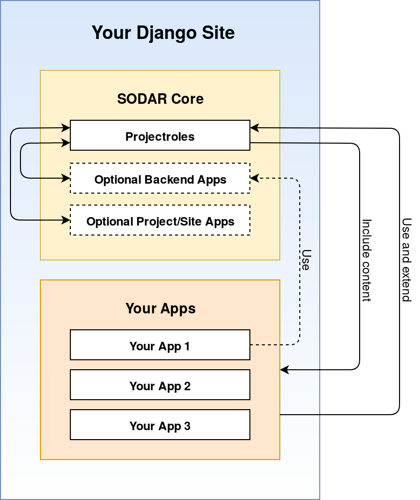

.. _overview:

SODAR Core Overview and Example Use Case
^^^^^^^^^^^^^^^^^^^^^^^^^^^^^^^^^^^^^^^^

This document presents an overview of the SODAR Core package along with an
example use case.

SODAR Core is a relatively complex system and we have created a :ref:`glossary`
to help you with keeping track of the terminology.

SODAR Core Overview
===================

The SODAR Core package provides a suite of :term:`Django apps<Django App>` to be
installed on a :term:`Django-based web site<Django Site>`. The main app in the
package, ``projectroles``, provides core project access, content management
framework and default UI templates for other apps on the site. Those apps must
implement or use specific parts of the projectroles app to enable desired SODAR
Core functionality.

Apps in a SODAR Core based site are separated into :term:`project<Project App>`,
:term:`site<Site App>` and :term:`backend<Backend App>` apps, depending on their
scope and purpose. The SODAR Core package includes optional general purpose apps
of each type, which the user may enable on their site if needed. These apps all
depend on projectroles. More on the general purpose apps can be found in the
:ref:`getting_started` document.

To build their own web based system with SODAR Core, the user will develop
required functionality and UIs as one or more Django apps, using and extending
functionalities offered by the projectroles app and optional backend apps. This
allows integration of the app into the project access management, standardized
layout and other features such as advanced logging. Furthermore, the
projectroles app will call certain functions implemented in the user's apps to
dynamically include app and project content in Django views. In addition to
developing new Django apps, existing apps can be easily modified to gain access
to SODAR Core features.

    Structure of a SODAR Core based web site

Example Use Case
================

In a typical scenario for SODAR Core use, a research organization wants to
develop a user friendly system for accessing, browsing and/or manipulating
research data. The data may belong to several different projects, with different
research groups or scientists working on it. This data may be confidential in
nature, so access control is required, preferably using the organization's
existing LDAP/AD servers. The organization wants to provide a web-based GUI as
well as programmatic API views.

Site Setup
----------

First the developer will
:ref:`set up a SODAR Core based Django site<app_projectroles_integration>`.
This can be created from a SODAR Core site template or by integrating the
``django-sodar-core`` package on an existing site. The Django site must be
configured according to organization requirements, e.g. setting up user access
via the organization LDAP/AD server.

The initial SODAR Core integration into a Django site adds e.g. a general
layout, organization of apps and content into projects as well as project-based
access control.

App Development
---------------

Next the developer needs to :ref:`develop the Django app(s)<development>` which
contain the actual program logic and user interfaces required for the use case.
The content or number of these apps are not restricted by SODAR Core. Anything
which would go to a typical Django app is OK, as long as certain building blocks
for SODAR Core functionality are used.

Optional applications bundled with SODAR Core can also be enabled or disabled at
this point. for example, if involved projects require sharing and storage of
reports and presentations, the developer may select to enable the
:ref:`filesfolders<app_filesfolders>` app. Likewise, if detailed logging or
audit trails are needed, the developer can enable the
:ref:`timeline<app_timeline>` app.

User and Project Setup
----------------------

Once the site is deployed, the developer should
:ref:`create initial project categories<app_projectroles_usage>` and provide
access to those for high level personnel such as project owners. The owners can
then go on and create relevant projects, grant access to researchers and set up
initial data in the applications.

Using the Site
--------------

The researchers will log in to the site on their web browser, in most cases
using the standard LDAP credentials provided by their organization. They will
see the projects they have been granted access to and can use whichever
applications have been enabled or developed for the site, according to their
assigned user rights. SODAR Core provides common navigation, overview and search
views for all enabled apps, including the one(s) developed by the organization.
The same user access management features are shared for all apps, along with
possible REST APIs developed by the organization.

Next Steps
==========

See the :ref:`getting_started` document for instructions on installing SODAR
Core and how to proceed with developing your own SODAR Core based site.
